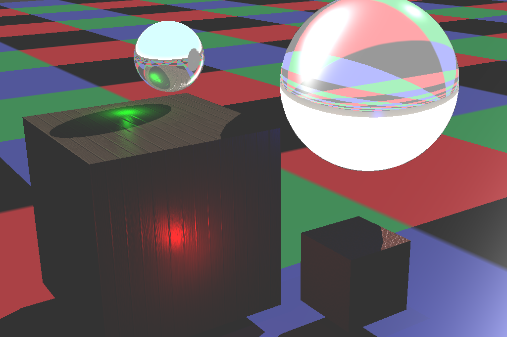

# Radium

This program, Radium, is a ray tracing demo which is written by me. It just a toy and couldn't be applied in any production environment. It just a practise of ray tracing. I learned the new course called Computer Graphics in this summer vacation so I write this for this course's homework.

## Features

This demo have:

* Ambient, diffuse, specular. (Use Phong model)
* Kr(reflection), Kt(transmission with IOR) support.
* UV texture. If a surface have this, use uv texture's color for its diffuse.
* Normalmap, including tangent space calculation. (maybe not correct)
* Shadow
* Trace depth and weight limit.
* Not standard Phong shading, but similar. The normal of each vertices are exported from Blender and shouldn't need to be calculated in program.

This demo will not have:

* Any ray tracing acceleration technology, such as octree, except boundingbox(align with axis).
* Monte Carlo Sampling. So the result image is clear and no noise. But, oppositely, away from real world.

## Components

Radium: The ray tracing program written in C#. I don't write it in C++ because my brain is dizzy when firstly writing this program, so I choose a language with GC system to reduce my dizzy. It may easy to refactored with C++, but I will not try this.

io_scene_radium: A Blender plugin which can export scene from Blender with the format which can be read by Radium. This plugin also take responsibility for converting the variables which comes from Principled BSDF to my ray tracing variables. This plugin works perfectly in Blender 2.93 LTS.

## Performance

Almost 7mins for a 1024x768 image. (very laggy)

## Debug system

If you want to debug this program (I also have debugged this too much times), you should build this program in Debug mode and open `TracingDebug` in `Scene.cs`(read code for how to open. it just change a bool variables). Then, the program will output a obj model file which indicate the ray, normal and etc. Then, you can import it in Blender with some configurations(Y forward, Z up, split by group). Then, you can watch the detail of each ray which calculated by program and try finding bugs.

## References

* [华中科技大学-计算机图形学](https://www.bilibili.com/video/BV1Zj411f7S3)
* [清华大学-计算机图形学基础](https://www.bilibili.com/video/BV13441127CH)
* [光线跟踪算法编程环境](http://cg.cs.tsinghua.edu.cn/course/): I use its transmission ray calculation method.
* [法线贴图 - LearnOpenGL CN](https://learnopengl-cn.github.io/05%20Advanced%20Lighting/04%20Normal%20Mapping/): I use its tangent space calculation method.

## Render result

